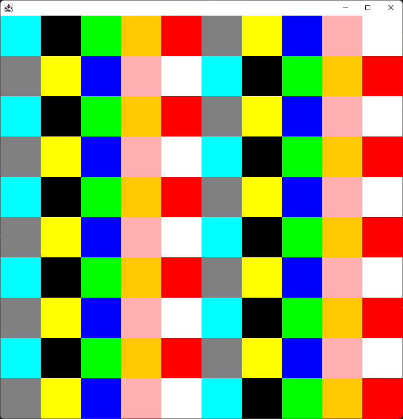

# Java Color Grid

## Overview

Create a grid of blocks using regular AWS Java.

### Usage

Determine your dimensions:

 - Height
 - Width
 - Rows
 - Columns

The size of the grid's blocks will be automatically determined by the space available.

```java
    int width = 800;
    int height = 800;
    int rows = 10;
    int cols = 10;

    ColorGridDimensions dimensions = new ColorGridDimensions();
    dimensions.setWidth(width);
    dimensions.setHeight(height);
    dimensions.setRows(rows);
    dimensions.setColumns(cols);
```

Set yourself up with a Frame:

```java
    JFrame window = new JFrame();
    window.setDefaultCloseOperation(JFrame.EXIT_ON_CLOSE);
    window.setSize(width, height);
    window.add(grid);
    window.setVisible(true);
```

Create some colors:

```java
    Color[] colors1 = new Color[] {
            Color.CYAN, Color.BLACK, Color.GREEN, Color.ORANGE, Color.RED,
            Color.GRAY, Color.YELLOW, Color.BLUE, Color.PINK, Color.WHITE
    };

    Color[] colors2 = new Color[] {
            Color.GRAY, Color.YELLOW, Color.BLUE, Color.PINK, Color.WHITE,
            Color.CYAN, Color.BLACK, Color.GREEN, Color.ORANGE, Color.RED
    };
```

Set the colors on the grid:

```java
    for (int i = 0; i < rows; i++) {
        if (i % 2 == 0) {
            grid.setRowColors(i, colors1);
        }
        else {
            grid.setRowColors(i, colors2);
        }
    }
```

Redraw:

```java
    grid.repaint();
```

Result:

